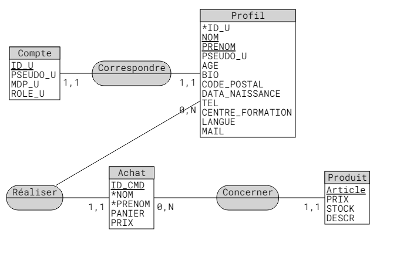

# Fichier readme du projet Asetar08 ! SIO1  

## Status des outils utilisés pour le projet :  

-Microsoft visual studio code / kwrite.  
-Php 7.3.31 deb10u1  
-Mariadb 10.3.34-deb10u1  
-Debian GNU/Linux 10  
-Dernière Update le 25/04 a 21h par Thibault    

  

Les rectangles étant des fichiers   
Les ellipses représentent la partie du modèle MVC appelée  
Le rond est le résultat final affiché de la page  
(Les étapes sont définies au dessus de chaque lien d'action)  
  
## Etat des fonctionnalités présentent au moment de l'update.

| Fonctionnalités | M (Modèle) | V (Vue) | C (Contrôleur) | Priorité |
| ----------- | ----------- | ----------- |----------- | ----------- |
| Accueil | Pas Besoin | $`\textcolor{blue}{\text{Finition}}`$ | $`\textcolor{green}{\text{Fait}}`$ | $`\textcolor{green}{\text{Fini 95 pourcent}}`$ |
| Login | $`\textcolor{green}{\text{Fait}}`$ | $`\textcolor{green}{\text{Fait}}`$ | $`\textcolor{green}{\text{Fait}}`$ | $`\textcolor{green}{\text{Fini 100 pourcent}}`$ |
| Logout | Pas Besoin | Pas besoin | $`\textcolor{green}{\text{Fait}}`$ | $`\textcolor{green}{\text{Fini 100 pourcent}}`$ |
| Profil | $`\textcolor{green}{\text{Fait}}`$ | $`\textcolor{green}{\text{Fait}}`$ | $`\textcolor{green}{\text{Fait}}`$ | $`\textcolor{green}{\text{Fini 95 pourcent}}`$ |
| ModifProfil | $`\textcolor{green}{\text{Fait}}`$ | $`\textcolor{green}{\text{Fait}}`$ | $`\textcolor{green}{\text{Fait}}`$ | $`\textcolor{green}{\text{Fini 70 pourcent}}`$ |
| Boutique | $`\textcolor{red}{\text{En cours !}}`$ | $`\textcolor{green}{\text{Fait}}`$ | $`\textcolor{red}{\text{En cours !}}`$ | $`\textcolor{red}{\text{Fini 20 pourcent}}`$ |
| Inscription | $`\textcolor{red}{\text{En pause}}`$ | $`\textcolor{blue}{\text{Finition}}`$ | $`\textcolor{red}{\text{En pause}}`$ | $`\textcolor{red}{\text{Fini 40 pourcent}}`$ |

## Arborescence  

Les {- dossiers -} sont en rouge alors que les {+ fichiers +} sont en vert. Les =/ symbolisent les couches de l'arborescence.

=>{- Site -}  
=/=>{- controleur -}  
=/=/=>{- accueil -}  
=/=/=/=>{+ accueil.php +}  
=/=/=>{- inscription -}  
=/=/=/=>{+ inscription_Controleur.php +}  
=/=/=>{- login -}  
=/=/=/=>{+ C_deco.php +}  
=/=/=/=>{+ login.php +}  
=/=/=>{- profil -}  
=/=/=/=>{+ C_profil.php +}  
=/=/=>{+ controleurPrincipal.php +}  
=/=>{- images -}  
=/=/=>{+ SchemaMD.png +}  
=/=>{- init -}  
=/=/=>{+ init.php +}  
=/=>{- modele -}  
=/=/=>{+ authentification_modele.php +}  
=/=/=>{+ connSQL_modele.php +}  
=/=/=>{+ inscription_modele.php +}  
=/=/=>{+ profil.php +}  
=/=>{- parametre -}  
=/=/=>{+ pageListe.php +}  
=/=>{- vue -}  
=/=/=>{- Boutique -}  
=/=/=/=>{+ Boutique.css +}  
=/=/=/=>{+ Boutique.html +}  
=/=/=>{- Accueil -}  
=/=/=/=>{+ accueil.html +}  
=/=/=/=>{+ acceuil.css +}  
=/=/=/=>{+ accueilDéco.html +}  
=/=/=>{- inscription -}  
=/=/=/=>{+ inscription.css +}  
=/=/=/=>{+ inscription.html +}  
=/=/=>{- login -}  
=/=/=/=>{+ connexion.css +}  
=/=/=/=>{+ connexion.html +}  
=/=/=>{- profil -}  
=/=/=/=>{+ PageProfil.css +}  
=/=/=/=>{+ PageProfil.php +}  
=/=/=/=>{+ PageProfilModif.php +}  
=/=>{+ bdAsetar.sql +}  
=/=>{+ index.php +}  
=/=>{+ readme.md +}  

## Choses utiles :  

-  `#f03c15` 
-  `#c5f015` 
-  `#1589F0`
- https://www.markdownguide.org/cheat-sheet/ <- Doc MD
- https://www.php.net/ <- Doc PHP
- https://sql.sh/ <- Doc SQL

# Listes des updates du readme :  
#### Update le 07/04 a 9h par Thibault  
####   
####   
####   
####   
####   
####   
